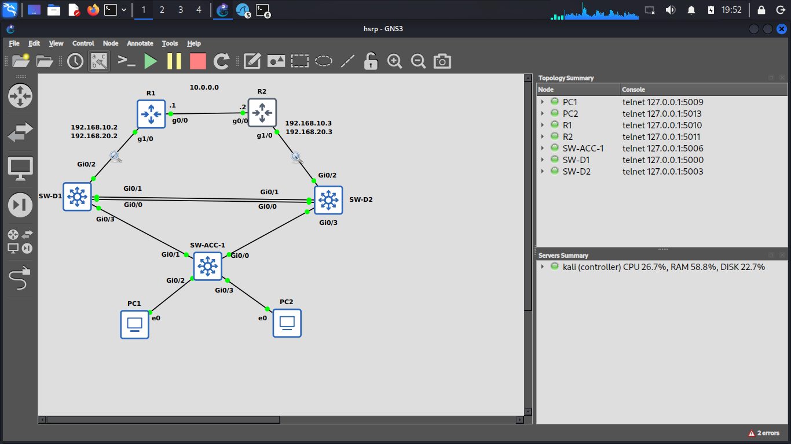

# Enterprise Redundancy & High Availability Lab (GNS3)

A comprehensive CCNA/CCNP-level redundancy project covering HSRP, STP Tuning, EtherChannel, Root Guard, BPDU Guard, and Failover testing.

## 🎯 Project Overview
Simulated a resilient enterprise network with redundant gateways (HSRP), load-balanced STP topology, and Layer 2 security features. The goal is to ensure zero downtime in case of link or device failure.

## 🏗️ Network Topology
!

## 📊 VLAN & IP Scheme
| VLAN | Name | Subnet | HSRP VIP | R1 (Active/Standby) | R2 (Active/Standby) |
|------|------|--------|----------|---------------------|---------------------|
| 10 | IT | 192.168.10.0/24 | 192.168.10.1 | Active (Pri 150) | Standby (Pri 100) |
| 20 | Sales | 192.168.20.0/24 | 192.168.20.1 | Standby (Pri 100) | Active (Pri 150) |

## 🛠️ Technologies Used
- **HSRP** (Hot Standby Router Protocol) for Gateway Redundancy
- **STP Tuning** (Root Primary/Secondary) for Load Balancing
- **EtherChannel (LACP)** between Distribution Switches
- **Root Guard** on Distribution Switches
- **BPDU Guard & PortFast** on Access Ports
- **ROAS (Router-on-a-Stick)** on R1 and R2

## ⚙️ Configuration Guide
Full configuration files are available in the [`configs/`](configs/) directory.
- [R1 Configuration](configs/R1.txt)
- [R2 Configuration](configs/R2.txt)
- [SW-D1 Configuration](configs/SW-D1.txt)
- [SW-D2 Configuration](configs/SW-D2.txt)
- [SW-ACC-1 Configuration](configs/SW-ACC-1.txt)

## ✅ Verification & Testing
| Test | Command | Result |
|------|---------|--------|
| HSRP Status | `show standby brief` | R1 Active for VLAN 10, R2 Active for VLAN 20 |
| STP Root | `show spanning-tree vlan 10` | SW-D1 is Root |
| EtherChannel | `show etherchannel summary` | `Po1(SU)` |
| Failover Test | Shutdown R1 Gi1/0 | R2 becomes Active, network stays up |

### Verification Outputs
- [HSRP Status](verification/hsrp-status.txt)
- [STP Root Status](verification/stp-root.txt)
- [EtherChannel Summary](verification/etherchannel.txt)
- [Failover Test Results](verification/failover-test.txt)

## 📚 Lessons Learned
1. **HSRP vs VRRP:** HSRP is Cisco proprietary, VRRP is open standard.
2. **Preempt & Priority:** Preempt ensures the router takes back its Active role after recovery.
3. **STP Tuning:** Using `root primary` and `root secondary` on different VLANs enables load balancing.
4. **Root Guard:** Prevents unauthorized switches from becoming the STP Root.
5. **Failover:** High Availability is about testing, not just configuring.

## 👤 Author
**Armin Isa** — [github.com/arminisa](https://github.com/arminisa)
